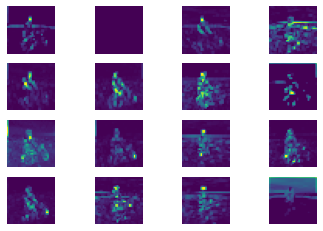
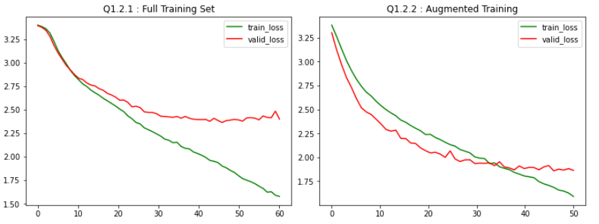

#### COMP5623M - Convolutional Image Classification and Visualisation

____

         

**Languages / Libraries Used:** Python, PyTorch, Torchvision, OpenCV

This project was part of the coursework for COMP5623M – Deep Learning at University of Leeds, which involved two stages: Training a small convolutional neural network (CNN) on a subset of Tiny ImageNet and then visualising the learnt filters, resulting feature maps, and gradients using GradCAM.

The CNN architecture was relatively simple and able to train on a single machine overnight, made up of just a few convolutional layers, utilising ReLu activation and max pooling operations for downsampling into fully connected latent space. The model was trained using supervised learning with a Cross Entropy loss function and utilised the Adam optimizer. Data augmentation was performed to increase the breadth of training samples and thus improve the overall accuracy and generalisation. 

Visualisation of the resulting model along with a reference AlexNet was the performed, first viewing the learnt filters as simple PyPlots. Next feature maps are convolved by these filters are visualised to view the receptive field of the network given a single training sample. Finally Gradient Weighted Class Activation Mapping (GradCAM) is used to visualise localisation maps to highlight relevant regions of each class to examine the models prediction. 

_____

##### Building

Requires Python 3.7+ and the required dependencies. Anaconda was used for development to making installing and managing dependencies easier, the environment can be reconstructed using : 

`conda create env -f enviro.yml` 

For grading sake the notebook was also saved as HTML file. 

___

##### Dependencies

See `environment.yml`

The key libraries used include: 

* PyTorch

* Numpy

* OpenCV

* MatplotLib

  
